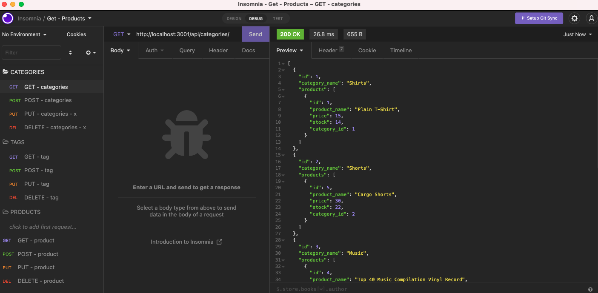
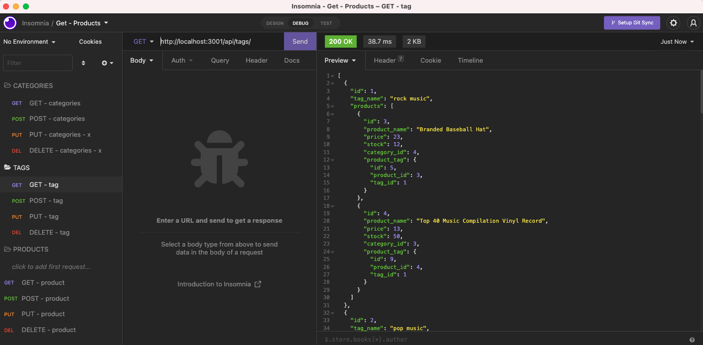
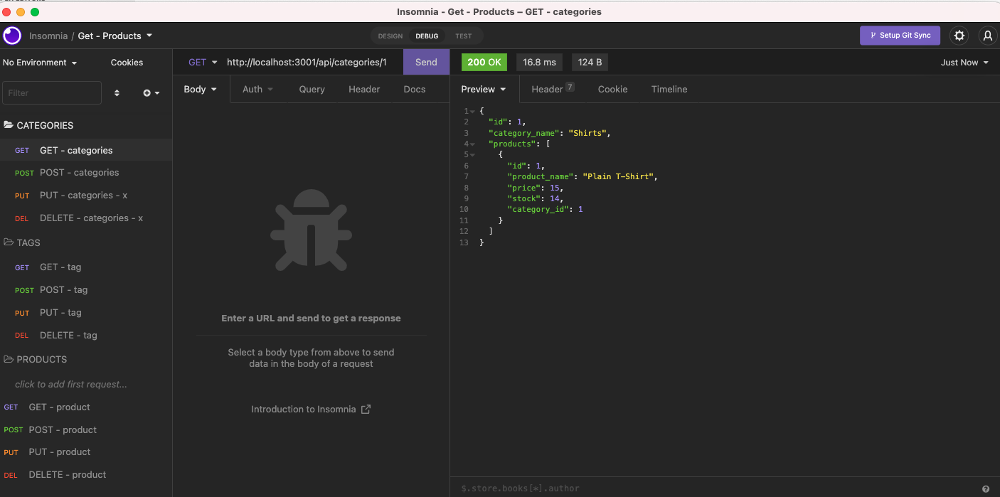
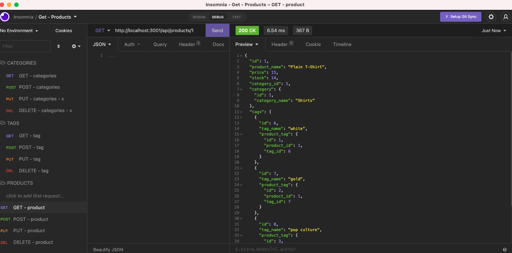
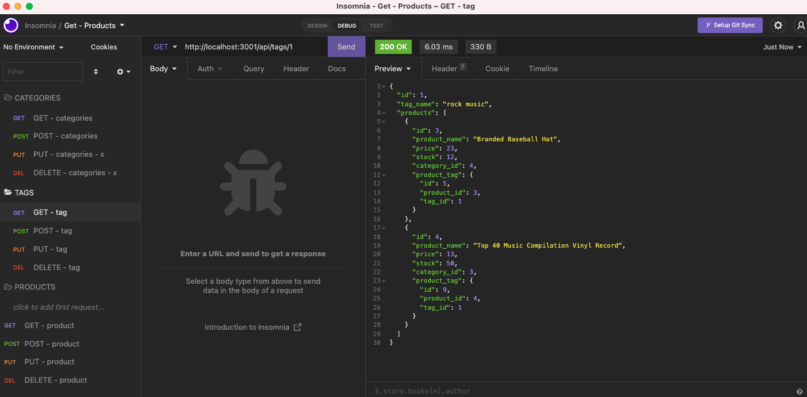

# e-commerce-orm
## 13 Object-Relational Mapping (ORM): E-Commerce Back End

## Description
This is a simple back end application that assists businesses with tracking and managing e-commerce products using Express, Sequalize to interact with MYSQL. 

## Table of Contents

* Installation
* Links
* Preview

## Installation
Requires terminal and node packages.
* npm init -y
* npm install
* Express API
* mysql12 (npm install --save mysql2 or npm i mysql2)
* dotenv

## Links
*Link to Video: 
*Link to Repository: 

## Preview Screens
Insomnia preview of GET routes to return all categories, all products, and all tags being tested in Insomnia:

 

Insomnia preview of GET routes to one category, product and tag:

